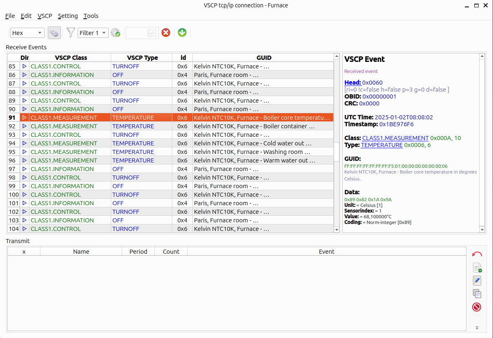

# vscp-works-qt

 

 

## Introduction

This is the new version of **vscpworks** that replaces [the long since deprecated version](https://github.com/grodansparadis/vscpworks). It is a total rewrite and there is still a lot of things to add and fix. There is currently very little documentation but it will grow as we go. The state of the code should be regarded as alpha still for some time.  That said a lot of functionality works and it may be a useful tool for VSCP developers. 

The VSCP system consists of the VSCP daemon, VSCP Works, and the VSCP helper libraries and a lot of other systems, code and hardware. The VSCP daemon is the core of the VSCP system and is responsible for handling events and actions. VSCP Works is a graphical user interface that is used to configure and manage VSCP nodes. The VSCP helper libraries are a set of libraries that provide functionality for working with VSCP events and actions.

  * Communication channels can be opened over socketcan/CANAL/tcp/ip and MQTT to remote devices. GUID's and sensors can have symbolic names. Easy to investigate event values and timing.  
  * Configuration handling can be onended to remote devices over socketcan/CANAL/tcp/ip and MQTT.
  * Scan of devices can be handled for remote devices over socketcan/CANAL/tcp/ip and MQTT.
  * Firmware loading can be done using the VSCP bootloader protocol and the PIC1 protocol. 
  * mdf editor is available that can be used to build mdf-files in XML or json format. This solution may still have problems with some more advanced files so be careful and save often.

Binary versions for Linux and windows is available in the release section.

The full documentation is available [here](https://grodansparadis.github.io/vscp-works-qt/#/)

## Install from binary file
See the [release section]() for binary files for Linux and Windows.

