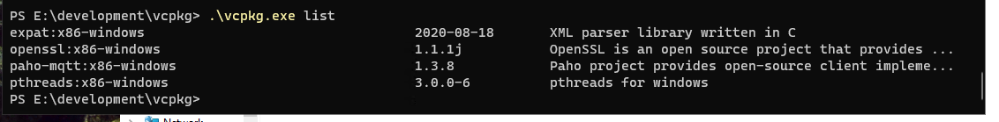

# vscp-works-qt


 

[](https://www.repostatus.org/#wip)


This is the project that eventually will be the next version of **vscpworks**. It is a total rewrite and is still far far far from a usable and stable state. There is no documentation. No user setup information and no help.

That said a lot of functionality works and it may be a useful tool in some situations (with some patience).

## Build on Linux
If you still want to build this project

### Install qt 5.0.
```bash
  sudo apt install qttools5-dev
  sudo apt install qt5-default
  sudo apt install libqt5serialbus5-dev
  sudo apt install qtdeclarative5-dev
  sudo apt install libqt5serialport5
  sudo apt install libqt5serialport5-dev
  sudo apt install libqt5charts-dev
```

### Install other needed libs

You need expat, mosquitto, openssl to build this project

```bash
  sudo apt install libexpat-dev
  sudo apt install libssl-dev
  sudo apt install libpaho-mqtt-dev
  sudo apt-get install libcurl4-openssl-dev
```

Paho version 1.3 or bigger should be used. Build manually from [Paho code repository](https://github.com/eclipse/paho.mqtt.c) with

```bash
  cmake .. -DPAHO_WITH_SSL=TRUE
```

to enable needed SSL

### You need the vscp repository for support source files

```bash
  git clone --recurse-submodules -j8 https://github.com/grodansparadis/vscp.git
  cd vscp
  git checkout development
``` 

This source is by default expected to be in a folder on the same level as the vscp-works-qt project. But you can use another location and set the path to this folder with *-DVSCP_PATH="path to vscp folder"* when issuing cmake for vscp-works-qt.

For now the *development branch* is needed for the vscp project. This is temporary.


### Clone the vscp-works-qt repository in a folder (on the same level as vscp above).
```bash
  git clone https://github.com/grodansparadis/vscp-works-qt.git
```  

### Go to the build folder and make the project
```bash
  cd vscp-works-qt
  mkdir build
  cd build
  cmake ..
```

use

```bash
  cmake -DCMAKE_BUILD_TYPE=Debug ..
```

if you want to build a version suitable for debugging.

use 

```bash
  cmake -DVSCP_PATH="path to vscp" ..
```

if you need to set a path to the local copy of the vscp main repository

## Build on Windows

If you don't have Visual Studio Code installed it is recommended. You can fined it [here](https://code.visualstudio.com/download).

Install cmake-tools, c++ extension

```bash
ext install cmake-tools
```

### VSCP main and VSCP works repositories
You need to checkout the VSCP main repository code as well (but not in the vcpkg folder). You do this with

```bash
  git clone https://github.com/grodansparadis/vscp.git
  cd vscp
  git checkout development
``` 

and the vscp-works-qt code

```bash
git clone https://github.com/grodansparadis/vscp-works-qt.git
```

### Optionally install Qt for uae of Qt tools

Go to the [qt site](https://www.qt.io/download) and follow the instructions

### Install the vcpkg package manager

Install the vcpkg package manager by cloning its github repository in a folder

```bash
git clone https://github.com/microsoft/vcpkg.git
```

then go into the folder

```bash
cd vcpkg
```

Run the vcpkg bootstrapper command

```bash
bootstrap-vcpkg.bat
```

The process is described in detail [here](https://docs.microsoft.com/en-us/cpp/build/install-vcpkg?view=msvc-160&tabs=windows)

To [integrate with Visual Studio](https://docs.microsoft.com/en-us/cpp/build/integrate-vcpkg?view=msvc-160) run

```bash
vcpkg integrate install
```

Install the required libs

```bash
vcpkg install qt5:x64-windows
vcpkg install pthread:x64-windows
vcpkg install dlfcn-win32:x64-windows
vcpkg install expat:x64-windows
vcpkg install openssl:x64-windows
vcpkg install paho-mqtt:x64-windows
vcpkg install qtcharts:x64-windows
```

The Qt installation may take some time

```bash
vcpkg list
```

will give 



after installing the required libs

Full usage is describe [here](https://docs.microsoft.com/en-us/cpp/build/manage-libraries-with-vcpkg?view=msvc-160&tabs=windows)


Build as usual but use

```bash
cd vscp-vscp-works
mkdir build
cd build
cmake .. -DCMAKE_BUILD_TYPE=Release|Debug -DVCPKG_ROOT=G:/akhe/development/vcpkg/ -DCMAKE_TOOLCHAIN_FILE=G:/akhe/development/vcpkg/scripts/buildsystems/vcpkg.cmake -G "Visual Studio 17 2022" -A x64
```

The **VCPKG_ROOT** and **CMAKE_TOOLCHAIN_FILE** path is most certainly different in your case

Note that *Release|Debug* should be either *Release* or *Debug*

_"Visual Studio 17 2022"_ may be _"Visual Studio 16 2019"_ or some other value depending on what Visual Studio you have installed

The windows build files can now be found in the build folder and all needed files to run the project can  after build - be found in build/release or build/Debug depending on CMAKE_BUILD_TYPE setting.

Building and configuration is simplified with VS Code installed. Configure/build/run can be done (se lower toolbar). Using VS Code it ,ay be useful to add

```json
"cmake.configureSettings": {
   "CMAKE_BUILD_TYPE": "${buildType}"
}
``` 

to your settings.json file.

To build at the command prompt use

```bash
cmake --build .
```

or 

```bash
msbuild vscp-works-qt.sln
```

Note that you must have a *developer command prompt*

-------------------------------------------------------------------------------

**Internal project Notes below**

## config

The config file for VSCP works qt is JSON based and have the following format

```json
{
    "version": "0.2.0",
    "configurations": [
        {
            "name": "test session",
            "type": "0"
        }
    ]
}
```

### configuration
Each item in the configuration section is a connection to a remote host. All have "name" and "type" in common while other tags may depend for different types.

#### name 
The name that is displayed to the user

#### type
The type for the connection. One of the following

| Type | Description |
| ---- | ----------- |
| 0 | No connection |
| 1 | tcp/ip connection |
| 2 | CANAL connection |
| 3 | Socketcan connection (Only on Linux) |
| 4 | ws1 connection  |
| 5 | ws3 connection  |
| 6 | MQTT connection |
| 7 | udp connection  |
| 6 | multicast connection |

##### No Connection


## cmake

### Problems

CMake Error at /usr/lib/x86_64-linux-gnu/cmake/Qt5/Qt5Config.cmake:28 (find_package):
  Could not find a package configuration file provided by "Qt5LinguistTools"
  with any of the following names:

    Qt5LinguistToolsConfig.cmake
    qt5linguisttools-config.cmake


Install qttools5-dev, qt5-default and qtdeclarative5-dev

git submodule update --init --recursive

git pull --recurse-submodules

git submodule foreach git pull origin master
s


git clone --recurse-submodules -j8 https://github.com/grodansparadis/vscp-works-qt.git

cd vscp-works-qt
cd src
mkdir build
cd build
cmake ..


----

## Linux

  * Need to install libqt5serialport5-dev

  sudo apt-get install libqt5serialport5
  sudo apt-get install libqt5serialport5-dev

## Enable debug

  cmake -DCMAKE_BUILD_TYPE=Debug

## deb install

  * https://www.debian.org/doc/manuals/debmake-doc/ch08.en.html#cmake-single
