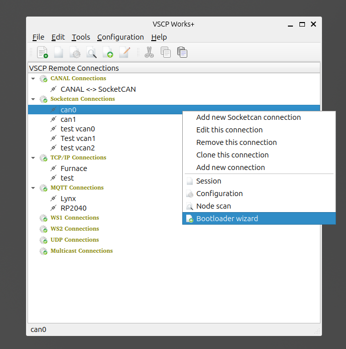
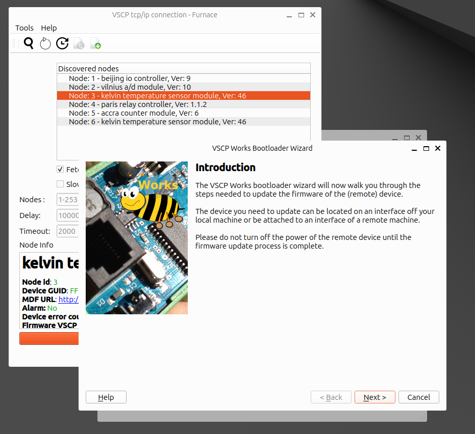
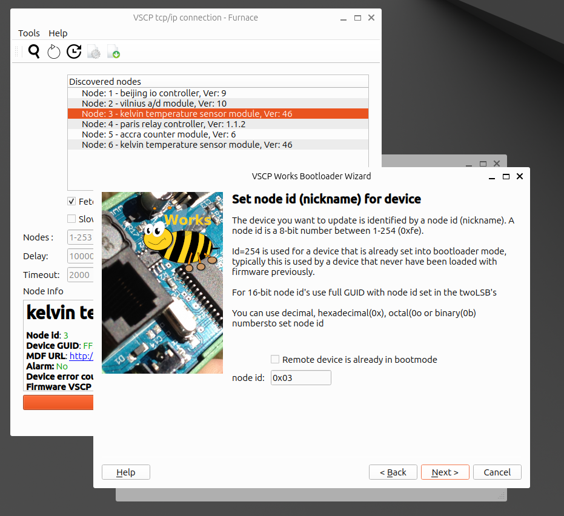
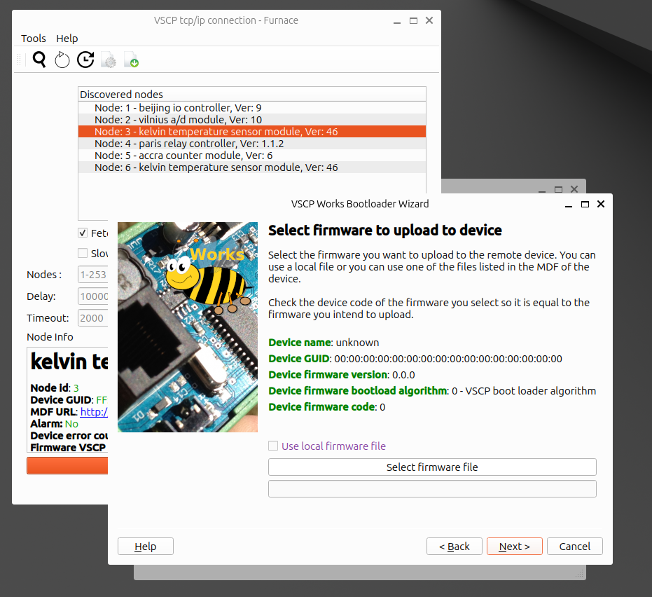
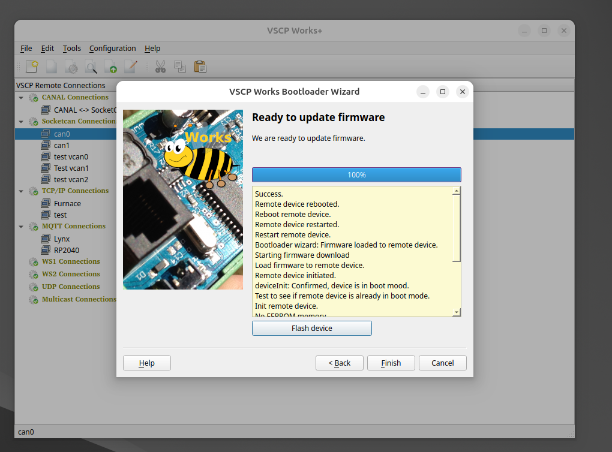

# Loading firmware

## Introduction

To load and update firmware on a remote hardware device is a common task in all kind of systems. The VSCP bootloader protocol is a generic bootloader protocol that can be used to load firmware on a remote device.The code is is hardware independent and can be used on any hardware platform that supports the VSCP protocol. There is free code available boot for client side implementations as well as for device side implementations. The code is available on GitHub. This is the standard way to load firmware on VSCP devices.

VSCP also allow for device manufacturer specific bootloaders that can be used to load firmware on a device. Currently there are bootloaders available for the following platforms in VSCP Works:

- VSCP bootloader - Works on most systems. Supports level I and level II
- PIC1 - Bootloader for PIC18F devices. A small bootloader that works on CAN systems. Supports only level I

## How to update firmware

Right click on the communication interface you want to use for the bootload operation and select `Bootloader wizard`. This will open the bootloader wizard. As an alternative you can click on the toolbar icon for the `bootloader wizard`. Hold the cursor over the icon to get a tooltip that says `bootloader wizard`. A third option is to select the communication channel and select boot loader wizard in the file menu.

To start the `bootloader wizard` in this way you need to know the nickname/node id for the node you want to update on the communication channel. If you don't know the nickname/node id you can use the node scan window to find it. This may be the easiest way to go in any case. Search for device on the communication channel and select the device you want to update. Right click on the device and select `Bootloader wizard`.

The first step just gives some information about the bootload process. Click `Next` to continue.

The next step is to set the `nickname/nodeid or GUID` for the device you want to update. This is the `nickname/nodeid or GUID` that the device is identified with. If you scanned nodes it will be set for you. 

If the device you want to load firmware on is a virgin VSCP device that comes from the production line it will allread be in boot loader mode. Check the `Remote device is already in boot loader mode` box if this is the case. The nickname/nodeid 0xfe is reserved for a virgin device.

If the device is not in boot loader mode you can set it in boot loader mode by sending a `NOOP` command to the device. This is done by checking the `Set remote device in boot loader mode` box.

Click `Next` to continue.

When the remote device is selected you have the option to choose if you want to use a local MDF file or if you want to load MDF file information from the device itself and download it. For a VSCP node the normal choice here is to use the information from the device. But in sme cases, such as development f a new node, a local MDF is the best choice. The MDF file is used to get information about the device and to get information about the firmware that is available for the device. The MDF will be parse when you move on.

Click `Next` to continue.

The next step is to select the firmware you want to load on the device. You can select a local file (`Select local firmware file`) or you can download the firmware that the MDF points to. The firmware file contains the binary data that will be loaded on to the device. The firmware file is parsed when you move on.

The `Device firmware code` is **VERY IMPORTANT**, this code that is a standard register code on a VSCP device and it is a code that change when hardware is changed in such a way that a specific firmware is not compatible with the hardware. The code should be the same for the firmware file and the register content. If not there is a risk that the remote device will nt function properly after a firmware upgrade.  **If the code is not correct the firmware should not be loaded on the device.**

Press `Select firmware file`to select one of the firmware files that are available for the device. Select a version that is higher then the one on the device and again make sure that the `Device firmware code` is the same.

Click `Next` to continue.

Now press `Flash device` and the firmware update process will start. The process will take some time and you will see the progress in the progress bar. When the process is done you will get a message that the firmware update is done. Also if something goes wrong you will get a message about that in the status area. You are now ready to use the device with the new firmware. Press `Finish`to exit the bootloader.