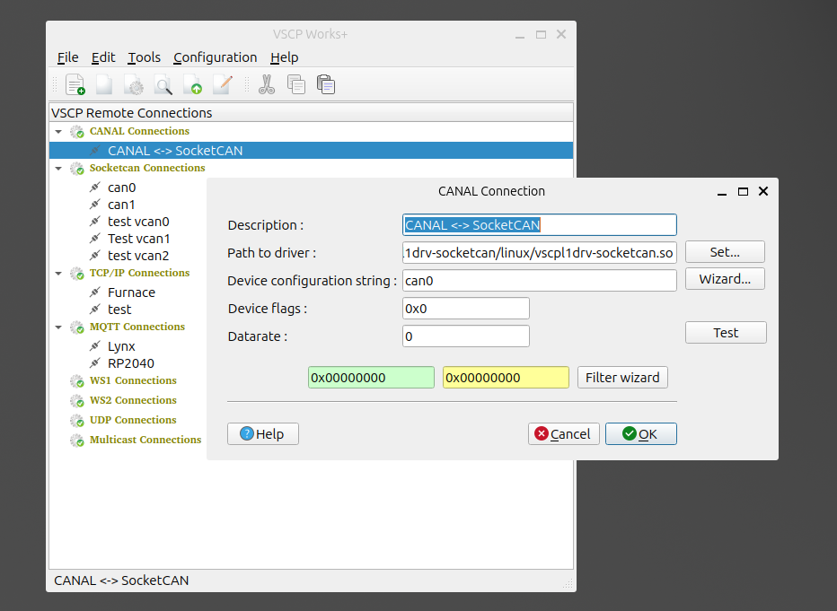

# CANAL

[**CANAL**](https://grodansparadis.github.io/vscp-doc-canal/#/)  The VSCP **CAN** **A**bstraction **L**ayer. This is a VSCP level I communication that is based on a CAN frame. A `CANAL driver`is the same as a `VSCP Level I driver` and this driver is responsible for abstraction from the VSCP world of events to low end frames or simulations. The frame format and other details is described [here](https://grodansparadis.github.io/vscp-doc-spec/#/./vscp_over_can_can4vscp)

## Add a connection

 - `Description`: Set a descriptive name. This value will be used to identify the connection in the treeview.
 - `Path to driver`: Set the path to the CANAL driver to use. Click `set` to browse for the file. CANAL drivers are the same as `VSCP level I drivers`and on most Linux systems you can find them by default in the _/var/lib/vscp/drivers/level1/_ folder. Windows system usually have them in the folder _appdir/VSCP/drivers/level1. The exact location depends on the installation for the driver.
 - `Device configuration string`: CANAL drivers are configured using a semicolon separated string. This string is deriver dependent. The exact format is described in the driver documentation. Some modern drivers have a wizard that can help you to construct this configuration string. Press `wizard` button to open this dialog.
- `Device flags`: This is a bit mask that can be used to set some flags for the driver. The exact meaning of the bits is driver dependent. The driver documentation will tell you what the bits mean.
- `Datarate`: This is a device specific value for the communication rate. It is usually in bits per second but the exact meaning is driver dependent. The driver documentation will tell you what the value should be. In most cases you can leave this value to the default value zero.

### Filter

The filter for a CANAL driver is two 32-bit values that are used to filter out messages that are not of interest. The first value is the mask and the second value is the filter. If the mask is zero all messages are passed. If the mask is not zero only messages that match the filter are passed. The filter is a bitwise AND operation between the mask and the message id. If the result is equal to the filter the message is passed. 

Truth table for filter/mask

| Mask bit n | Filter bit n | Incoming event class/type bit n | Accept or reject bit n |
|:------------:|:--------------:|:---------------------------:|:------------------------:|
| 0 | x | x | Accept |
| 1 | 0 | 0 | Accept |
| 1 | 0 | 1 | Reject |
| 1 | 1 | 0 | Reject |
| 1 | 1 | 1 | Accept |

Think of the mask as having ones at positions that are of interest and the filter telling what the value should be for those bit positions that are of interest.

  - So to only accept one class set all mask bits to one and enter the class in filter.
  - To accept all classes set the mask to 0. In this case filter don't care.

  

The `Filter wizard`  makes it easy to construct filters for your specific need. Just press the `wizard` button and the dialog will open. Enter the class and type you want to filter on and the wizard will construct the filter and mask for you.

Press the ID/Mask` button to open the dialog where you can enter the filter and mask manually as a 32-bit value.

The `wizard button` can give you a view of what events are filtered out an not. Select what you are interested in the right part and transfer  as filter value using `<<` button or vice versa using the `>>` button.

In all above cases the numerical base dialog can be used to set the display numerical base for all values. The default is hexadecimal but you can also use decimal, octal or binary. Numbers can be entered using any base. Just proceed hexadecimals with `0x`, octals with `0o` and binary with `0b`. No prefix will be read as decimal values.

## Remove a connection

Select the connection you want to remove in the treeview and right click. Select `Remove connection` in the context menu. The connection will be removed.

## Edit a connection

Select the connection you want to edit in the treeview and right click. Select `Edit connection` in the context menu. A dialog will open where you can edit the parameters for the connection.

## Clone a connection

Select the connection you want to clone in the treeview and right click. Select `Clone connection` in the context menu. A dialog will open where you can edit the parameters for the connection. You must set a new name for the connection.

## Connect to a remote node

Select the connection you want to connect to in the treeview and right click. Select the service your want (session/configure/scan/firmware load) in the context menu. The connection will be established.