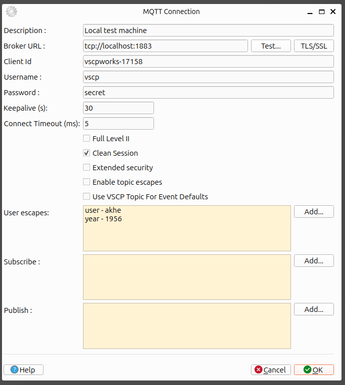

# MQTT

[MQTT](https://grodansparadis.github.io/vscp-doc-spec/#/./vscp_over_mqtt) - VSCP over MQTT.

## Add a connection



### Description
Set a name for the connection. This is the name shown in the connection list.

### Broker URL
This is the URL to the MQTT broker. It can be a hostname or an IP address. It can also include a port number. If no port number is given the default MQTT port 1883 is used. Normally precede with `mqtt://`. If the URL starts with `mqtts://` the connection is encrypted using TLS/SSL.  You can also use `tcp://` and `stcp://`.

### Client id
Client id used when connecting to the MQTT broker. If not set a random client id is generated.

### Username
Username used when connecting to the MQTT broker that requires authentication.

### Password
Password used when connecting to the MQTT broker that requires authentication.

### Keep alive
Number of seconds between keep alive messages. If no keep alive message is received within 1.5 times this period the connection is considered lost.

### Connection timeout
Number of milliseconds to wait for a connection before giving up. Default is 5000, i.e. 5 seconds.

### Full Level II
If this is checked the connection will use the full VSCP Level II protocol and full GUID to identify remote nodes.

### Clean session
If this is checked the connection will be a clean session. This means that the broker will not store any messages for the client when it is offline.

### Extended security
If this is checked the connection will use extended security. This means that the connection will be encrypted and authenticated.

### Use VSCP Topic For Event Defaults
If this checkbox is checked the connection will use the VSCP topic for event defaults. This means that the connection will get GUID, class and type from the topic if all or some of them are set to zero. This require the topic to use the _standard_ VSCP MQTT topic format on the form

```bash
vscp/<guid>/<class>/<type>
```
This makes it possible to send very low overhead events over MQTT. More info is [here](https://grodansparadis.github.io/vscp-doc-spec/#/./vscp_over_mqtt?id=minimize-transfer-load)

### Subscriptions


Set the topics you want to subscribe to here. You can set as many as you like. The format for the topic for a channel from a VSCP node is typically

```bash
vscp/<guid>/<class>/<type>/<nickname>/<sensor-index>/<zone>/<subzone>
```
Where nickname is the least significant bytes of the GUID and sensor-index, zone and subzone are optional. If you want to subscribe to all events from a node you can use

```bash
vscp/<guid>/#
```

If you want to subscribe to all events from all nodes you can use

```bash
vscp/#
```

You can also use wildcards in the topic. For example

```bash
vscp/<guid>/<class>/<type>/+/<sensor-index>/#
```

which will subscribe to all events from a specific sensor-index from any node but only events of a specific class/type.


### Publishing


Just as for subscriptions you can set as many publishing topics as you like. The format for the topic for a channel from a VSCP node is typically

```text 
vscp/<guid>/<class>/<type>/<nickname>/<sensor-index>/<zone>/<subzone>
```
Where nickname is the least significant bytes of the GUID and sensor-index, zone and subzone are optional. 

All topics can have the same [mustache escapes](https://en.wikipedia.org/wiki/Mustache_(template_system)) as the VSCP daemon have which are described  
[here](https://grodansparadis.github.io/vscp/#/publishing_server?id=publishing-server-topic-escapes). For instance you can insert the GUID of the current event with the mustache escape `{{guid}}` in the topic. Setting a topic on the standard VSCP form can thus be setup as

```mustache
vscp/{{guid}}/{{class}}/{{type}}/{{nickname}}
```

### Test connection


### TLS/SSL
Set security parameters for the connection. If you want to use TLS/SSL you must set the parameters here.

## Remove a connection

Select the connection you want to remove in the treeview and right click. Select `Remove connection` in the context menu. The connection will be removed.

## Edit a connection

Select the connection you want to edit in the treeview and right click. Select `Edit connection` in the context menu. A dialog will open where you can edit the parameters for the connection.

## Clone a connection

Select the connection you want to clone in the treeview and right click. Select `Clone connection` in the context menu. A dialog will open where you can edit the parameters for the connection. You must set a new name for the connection.

## Connect to a remote node

Select the connection you want to connect to in the treeview and right click. Select the service your want (session/configure/scan/firmware load) in the context menu. The connection will be established.