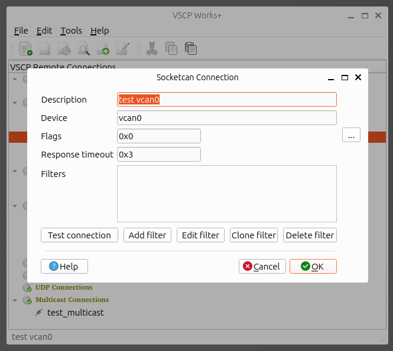
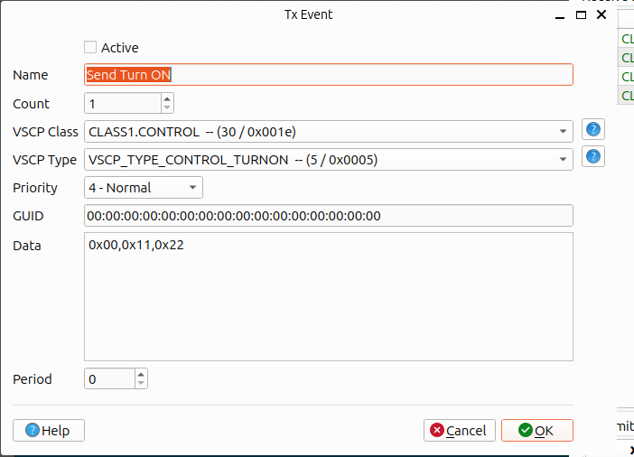
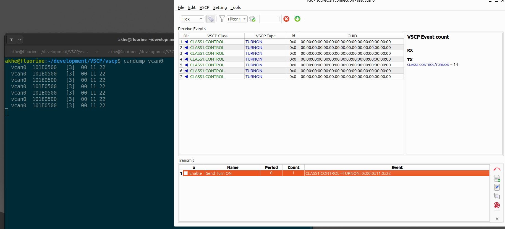
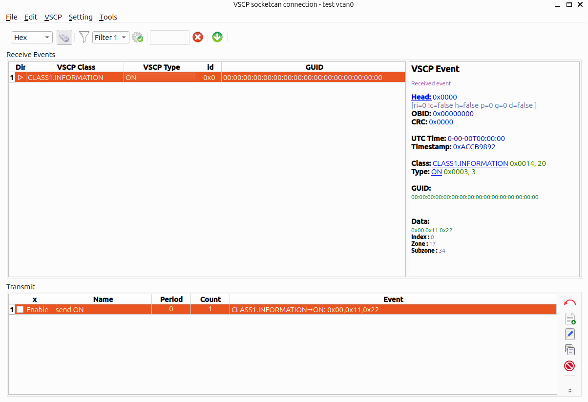

# Socketcan

You can read more about [VSCP over Socketcan](https://grodansparadis.github.io/vscp-doc-spec/#/./vscp_over_can_can4vscp) in the VSCP specification. The Linux kernel supports the CAN bus via the `socketcan` interface. This is also a VSCP level I communication that is based on a CAN frame. Needless to say only available on Linux systems. 

Socketcan is only available on Linux systems.

## Add a connection

Select the connection type you want to add in the treeview and right click. Select `Add connection` in the context menu. A dialog will open where you can enter the parameters for the connection.


 - `Description`: Set a descriptive name. This value will be used to identify the connection in the treeview.
 - `Device`: Set the device name for the CAN interface. This is usually something like `can0` or `can1`. The exact name is system dependent. You can find the names in the `/sys/class/net/` folder.
 - `Flags`: Socketcan flags. The flags are used to set some special options for the CAN interface.  Press the `...` button to open a dialog where you can set the flags.
 - `Response timeout`: The time in milliseconds to wait for a response from the device. If no response is received the operation will be aborted.
  - `Filters`: You can set any number of filters for the CAN interface. The filter is a 32-bit value that is used to filter out messages that are not of interest. If the mask is zero all messages are passed. If the mask is not zero only messages that match the filter are passed. The filter is a bitwise AND operation between the mask and the message id. If the result is equal to the filter the message is passed.

### Test button
Press the `Test connection` button to check if your socketcan settings works.

### Filters
You can use the `Add filter` button to add a filter, `Edit filter` button to edit a selected a filter, `Clone filter` button to clone a selected filter and `Delete filter` button to remove a selected filter.

- Click on a filter item to select it.
- Double click on a filter item to edit it.
- Right click on a filter item to get a context menu where you can edit, clone or delete the filter.

See [CANAL filters](connections.md) for more information about filters.

## Remove a connection

Select the connection you want to remove in the treeview and right click. Select `Remove connection` in the context menu. The connection will be removed.

## Edit a connection

Select the connection you want to edit in the treeview and right click. Select `Edit connection` in the context menu. A dialog will open where you can edit the parameters for the connection.

## Clone a connection

Select the connection you want to clone in the treeview and right click. Select `Clone connection` in the context menu. A dialog will open where you can edit the parameters for the connection. You must set a new name for the connection.

## Connect to a remote node

Select the connection you want to connect to in the treeview and right click. Select the service your want (session/configure/scan/firmware load) in the context menu. The connection will be established.

## Testing

If you have can utils installed you can use the `cansend` and `candump` utilities to test your the socketcan support of VSCP Works. You can install can-utils with the following commands.

```bash
sudo apt update
sudo apt upgrade
sudo apt install can-utils
```

on a Debian type system like Ubuntu etc. If yuou have another type of system you can use the package manager for that system to install can-utils or install and build from it from source.

Now you need to setup a virtual can interface you can use the following commands.

```bash
# Virtual i/f 0
sudo ip link add dev vcan0 type vcan
sudo ip link set up vcan0 mtu 72
```
This will create a virtual can interface `vcan0` that you can use to test the socketcan support of VSCP Works. The lastline set the interface to can fd mode and is not needed.

You can construct as many virtual can interfaces as you like.

Now bring up the interface with

```bash
sudo ip link set can0 up
```

Later, when you are done with the interface you can remove it with

```bash
sudo ip link set can0 down
``` 

bit leave it open now.

### Listen to events sent from VSCP Works

Open a terminal and write

```bash
candump vcan0
``` 

This will listen to all events sent on the `vcan0` interface.

Now add a new socketcan connection in VSCP Works+ looking like this



and open a session window by doubleclicking on the item and define transmission events like this one



this will look something like this



The usual positive response to a [CLASS1.CONTROL, VSCP_TYPE_TURN_ON](https://grodansparadis.github.io/vscp-doc-spec/#/./class1.control?id=type5) events is a [CLASS1.INFORMATION, VSCP_TYPE_INFORMATION_ON](https://grodansparadis.github.io/vscp-doc-spec/#/./class1.information?id=type3) event. To send it you can use cansend (possibly in a new terminal window) like this

```bash
cansend vcan0 10140300#001122
```

This will send a [CLASS1.INFORMATION, VSCP_TYPE_INFORMATION_ON](https://grodansparadis.github.io/vscp-doc-spec/#/./class1.information?id=type3) event to the `vcan0` interface. And you should see the event in the terminal window where you run `candump vcan0` and also in the VSCP Works+ session window.



The socketcan representation may be awkward at first but this is just the way VSCP packs VSCP events into CAN frames. You can read more about this [here](https://grodansparadis.github.io/vscp-doc-spec/#/./vscp_over_can_can4vscp).


