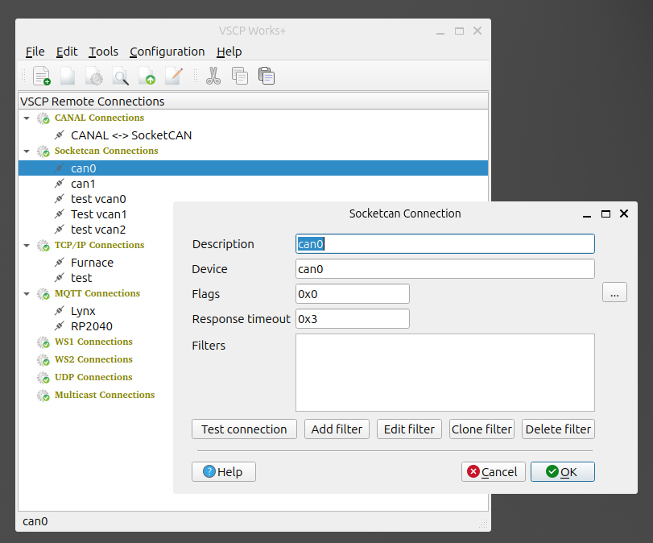

# Add a connection

Select the connection type you want to add in the treeview and right click. Select `Add connection` in the context menu. A dialog will open where you can enter the parameters for the connection.

 - `Description`: Set a descriptive name. This value will be used to identify the connection in the treeview.
 - `Device`: Set the device name for the CAN interface. This is usually something like `can0` or `can1`. The exact name is system dependent. You can find the names in the `/sys/class/net/` folder.
 - `Flags`: Socketcan flags. The flags are used to set some special options for the CAN interface.  Press the `...` button to open a dialog where you can set the flags.
 - `Response timeout`: The time in milliseconds to wait for a response from the device. If no response is received the operation will be aborted.
  - `Filters`: You can set any number of filters for the CAN interface. The filter is a 32-bit value that is used to filter out messages that are not of interest. If the mask is zero all messages are passed. If the mask is not zero only messages that match the filter are passed. The filter is a bitwise AND operation between the mask and the message id. If the result is equal to the filter the message is passed.

## Test button
Press the `Test connection` button to check if your socketcan settings works.

## Filters
You can use the `Add filter` button to add a filter, `Edit filter` button to edit a selected a filter, `Clone filter` button to clone a selected filter and `Delete filter` button to remove a selected filter.

- Click on a filter item to select it.
- Double click on a filter item to edit it.
- Right click on a filter item to get a context menu where you can edit, clone or delete the filter.

See [CANAL filters](connections.md) for more information about filters.