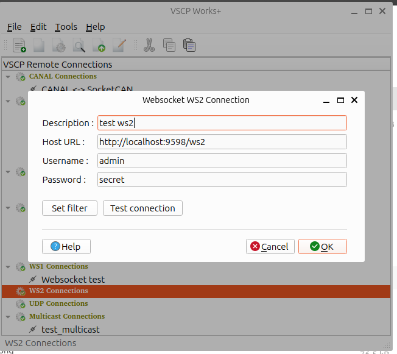

# ws2

You can read more about string based VSCP websocket protocol [ws2](https://grodansparadis.github.io/vscp-doc-spec/#/./vscp_websocket?id=ws2-description) in the VSCP specification. 

## Add a connection

## Remove a connection

Select the connection you want to remove in the treeview and right click. Select `Remove connection` in the context menu. The connection will be removed.

## Edit a connection

Select the connection you want to edit in the treeview and right click. Select `Edit connection` in the context menu. A dialog will open where you can edit the parameters for the connection.

## Clone a connection

Select the connection you want to clone in the treeview and right click. Select `Clone connection` in the context menu. A dialog will open where you can edit the parameters for the connection. You must set a new name for the connection.

## Connect to a remote node

Select the connection you want to connect to in the treeview and right click. Select the service your want (session/configure/scan/firmware load) in the context menu. The connection will be established.

