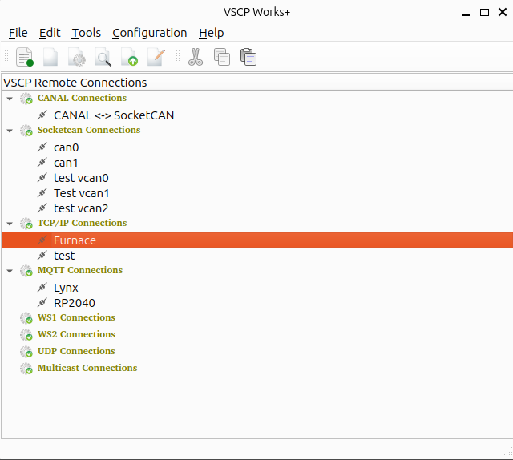

# Introduction

In the mainwindow of VSCP Works you have a treeview with all communication channels that are available. This is the place where you add, remove and configure connections to your remote hardware devices. Normally you right click on the treeview and select the operation you want to perform. You can also use the file menu items or the toolbar for the same task. It is perfectly fine for most cases to have several windows open at the same time to a selected communication item. 

# Communication types/protocols

VSCP Works can communicate with a diverse number of different hardware devices using many different communication protocols. The following protocols are currently supported:

  * [CANAL](./connections?id=canal)
  * [Socketcan](./connections?id=socketcan)
  * [tcp/ip](./connections?id=tcp/ip)
  * [MQTT](./connections?id=mqtt)
  * [WS1](./connections?id=ws1)
  * [WS2](./connections?id=ws2)
  * [UDP](./connections?id=udp)
  * [Multicast](./connections?id=multicast)

| Protocol | Description |
|----------|-------------|
| [**CANAL**](https://grodansparadis.github.io/vscp-doc-canal/#/) | The VSCP **CAN** **A**bstraction **L**ayer. This is a VSCP level I communication that is based on a CAN frame. A `CANAL driver`is the same as a `VSCP Level I driver` and this driver is responsible for abstraction from the VSCP world of events to low end frames or simulations. The frame format and other details is described [here](https://grodansparadis.github.io/vscp-doc-spec/#/./vscp_over_can_can4vscp)  |
| [**Socketcan**](https://grodansparadis.github.io/vscp-doc-spec/#/./vscp_over_can_can4vscp) | The Linux kernel supports the CAN bus via the `socketcan` interface. This is also a VSCP level I communication that is based on a CAN frame. Needless to say only available on Linux systems. |
| [tcp/ip](https://grodansparadis.github.io/vscp-doc-spec/#/./vscp_over_tcp_ip) | VSCP tcp/ip link protocol. |
| [MQTT](https://grodansparadis.github.io/vscp-doc-spec/#/./vscp_over_mqtt) | VSCP over MQTT.  |
| [ws1](https://grodansparadis.github.io/vscp-doc-spec/#/./vscp_websocket?id=ws1-description) | A VSCP websocket protocol that is string based. |
| [wsw](https://grodansparadis.github.io/vscp-doc-spec/#/./vscp_websocket?id=ws2-description) | A VSCP websocket protocol that is JSON based. |
| [UDP](https://grodansparadis.github.io/vscp-doc-spec/#/./vscp_over_udp) | VSCP connection less UDP communication protocol. |
| [Multicast](https://grodansparadis.github.io/vscp-doc-spec/#/./vscp_over_multicast?id=vscp-multicast) | VSCP multicast.  |

Click on the protocol name to get more information about the protocol.

# Remove a connection

Select the connection you want to remove in the treeview and right click. Select `Remove connection` in the context menu. The connection will be removed.

# Edit a connection

Select the connection you want to edit in the treeview and right click. Select `Edit connection` in the context menu. A dialog will open where you can edit the parameters for the connection.

# Connect to a connection

Select the connection you want to connect to in the treeview and right click. Select the service your want (session/configure/scan/firmware load) in the context menu. The connection will be established.