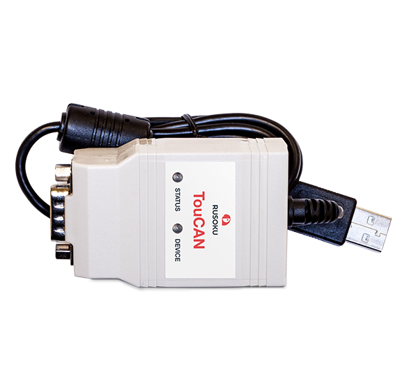
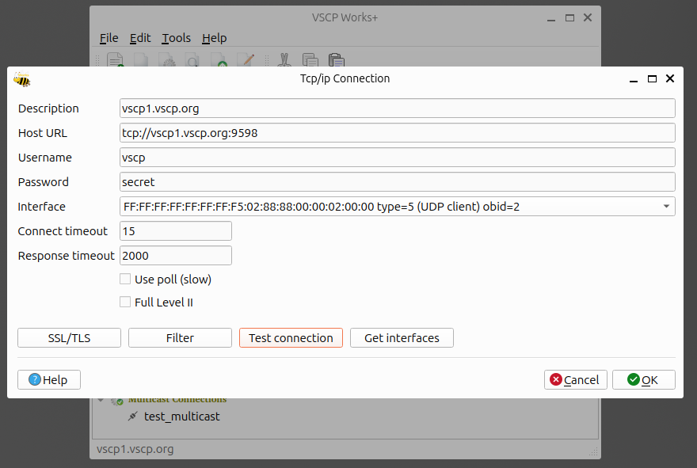
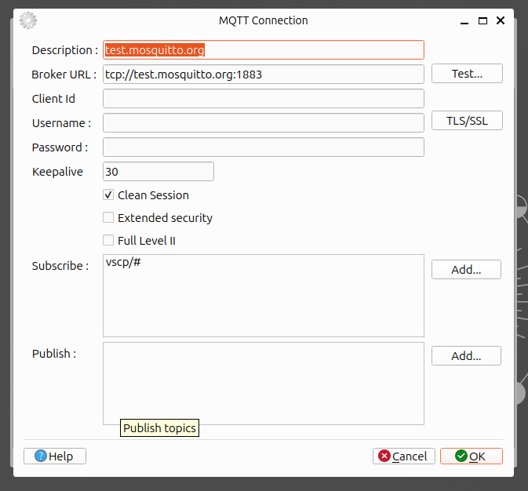

# Demo 

There are some demo locations you can use to get started with VSCP Works +. The demo data is described in the [VSCP wiki](https://github.com/grodansparadis/vscp/wiki/Demo). The current demo exports real time events from a number of nodes in the house where we have our office.

Described below is how you connect to these resource with VSCP Works +

## CANAL


To test CANAL you must install a CANAL driver. We recommend [TouCAN CAN adapter](https://www.rusoku.com/products) as a good starting point. You find there CANAL driver in the download section of there site. The TouCAN can also be used on Linux and on MacOS.

## SocketCan
Download and install the [VSCP Simulator](https://github.com/grodansparadis/vscp-simulator) software. It will allow you to simulate level I and level II nodes with all functionality.

A CAN adapter like TouCAN described above that supports SocketCan id definitely needed if you are serious using socketcan.

## tcp/ip


Create a new tcp/ip connection with the data above and you will receive a bunch of VSCP events generated in this house. The meaning of them all is in the wiki.

## MQTT


Create a new MQTT connection with the data above and you will receive a bunch of VSCP events generated in this house. The meaning of them all is in the wiki.

An alternative is use mqtt.vscp.org as server with **user**: _"vscp"_ and **password**: _"secret"_.

## Demo GUID and sensor database

[Here](https://vscp.org/vscpworks/vscpworks.sqlite3) is a demo database with GUID's and sensor indexes for the nodes that publish events. Copy this file to 

```bash
~/.local/share/VSCP/vscp-works/qt
```

on Linux, and to

```bash
C:\Users\<<<your user name>>>\AppData\Local\vscp-works-qt/
```

Now when you start VSCP Works + and connect to one of the above channels you will get symbolic GUID's and sensor information in the session window.

