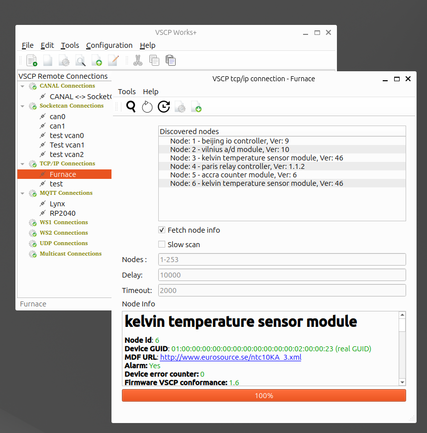

# Node scan 

## Description

In the node scan window you can search nodes on a bus. That is you can discover nodes on a bus without waiting for them to identify themselves by sending heartbeats. In the standard case the [MDF](https://grodansparadis.github.io/vscp-doc-spec/#/./vscp_module_description_file) of a node is downloaded when the node is discovered. Discovered nodes provide instant information about themselves. You can go directly to firmware update, sessions and node configuration from the node scan window. 

