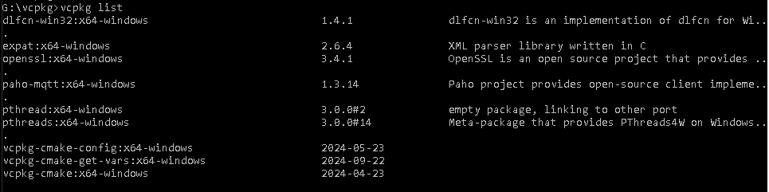

# Setting up on Windows

This document describes how to set up the VSCP Works application on a Linux system.  You can either build the executable from source yourself or more convenient download a binary version. Instructions on how t5o get the binary is [here](./setting_up_the_system.md).

## Build from source on Windows

If you don't have Visual Studio Code installed it is recommended. You can find it [here](https://code.visualstudio.com/download).

Install cmake-tools, c++ extension

```bash
ext install cmake-tools
```

### VSCP main and VSCP works repositories
You need to checkout the VSCP main repository code as well (but not in the vcpkg folder). You do this with

```bash
  git clone --recurse-submodules -j8 https://github.com/grodansparadis/vscp.git
  cd vscp
  git checkout development
``` 

and the vscp-works-qt code

```bash
git clone --recurse-submodules -j8 https://github.com/grodansparadis/vscp-works-qt.git
```

### Optionally install Qt for uae of Qt tools

Go to the [qt site](https://www.qt.io/download) and follow the instructions

### Install the vcpkg package manager

Install the vcpkg package manager by cloning its github repository in a folder

```bash
git clone https://github.com/microsoft/vcpkg.git
```

then go into the folder

```bash
cd vcpkg
```

Run the vcpkg bootstrapper command

```bash
bootstrap-vcpkg.bat
```

The process is described in detail [here](https://docs.microsoft.com/en-us/cpp/build/install-vcpkg?view=msvc-160&tabs=windows)

To [integrate with Visual Studio](https://docs.microsoft.com/en-us/cpp/build/integrate-vcpkg?view=msvc-160) run

```bash
vcpkg integrate install
```

Install the required libs

```bash
vcpkg install pthread:x64-windows
vcpkg install dlfcn-win32:x64-windows
vcpkg install expat:x64-windows
vcpkg install openssl:x64-windows
vcpkg install paho-mqtt:x64-windows
```

The Qt installation may take some time

```bash
vcpkg list
```

will give 



after installing the required libs

Full usage is describe [here](https://docs.microsoft.com/en-us/cpp/build/manage-libraries-with-vcpkg?view=msvc-160&tabs=windows)


Build as usual but use

```bash
cd vscp-vscp-works
mkdir build
cd build
cmake .. -DCMAKE_BUILD_TYPE=Release -DVCPKG_ROOT=G:/vcpkg/ -DCMAKE_TOOLCHAIN_FILE=G:/vcpkg/scripts/buildsystems/vcpkg.cmake -G "Visual Studio 17 2022" -A x64 -DCMAKE_PREFIX_PATH=g:/Qt/6.8.1/msvc2022_64
```

The **VCPKG_ROOT** and **CMAKE_TOOLCHAIN_FILE** path is most certainly different in your case

Note that *Release* should be either *Release* or *Debug* as of your preferences

_"Visual Studio 17 2022"_ may be _"Visual Studio 16 2019"_ or some other value depending on what Visual Studio you have installed

The windows build files can now be found in the build folder and all needed files to run the project can  after build - be found in build/release or build/Debug depending on CMAKE_BUILD_TYPE setting.

Building and configuration is simplified with VS Code installed. Configure/build/run can be done (see lower toolbar). Using VS Code it may be useful to add

```json
"cmake.configureSettings": {
   "CMAKE_BUILD_TYPE": "${buildType}"
}
``` 

to your settings.json file. Or to use 

To build at the command prompt use **--config Release** or **--config Release**

```bash
cmake --build . --config Release
```

or 

```bash
msbuild vscp-works-qt.sln
```

Note that you must have a *developer command prompt*

**Note:** You may experience a lot of warnings from spdlog which is a library that is part if vscp-works-qt. This is nothing to to worry about. More info on the subject is [here](https://github.com/gabime/spdlog/issues/2065).